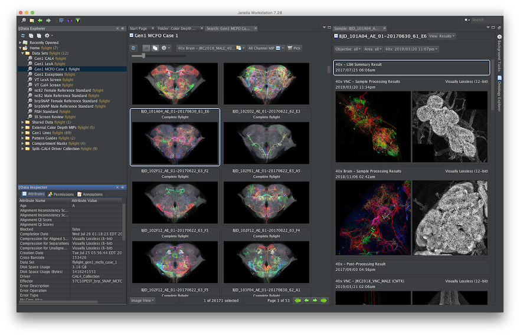

# Janelia Workstation

The Janelia Workstation is a neuroscience discovery platform for processing, analysis, annotation, and sharing of large-scale 3d microscopy data. The Workstation supports the FlyLight and MouseLight team projects at Janelia Research Campus. 

The Janelia Workstation currently supports two large-scale team projects at Janelia Research Campus: **FlyLight** and **MouseLight**:
* The **MouseLight** tools have been fully open sourced and made available here with complete documentation. These tools enable neuron tracing and connectomics on terabyte-scale Mouse brain volumes. 
* The **FlyLight** tools have been partially open sourced, and not yet officially supported. At Janelia, these tools will support search, browsing, and annotation of millions of confocal-imaged Fly nervous systems. In the future they will be fully released here.

## License and Citation Agreement

This software uses a modified Janelia Open Source License, and requiring [citation](https://doi.org/10.25378/janelia.8182256.v1) when used in studies or publications. [For details see here](LICENSE.md).

## For Users

Read the [User Manual](docs/UserManual.md) to find out more about the Workstation's capabilities and how to use them.

## For System Administrators

### System Installation

The Workstation Client (this repository) is supported by a set of back-end services. Deploying all of these services is easily accomplished through the use of Docker containers. Complete documentation about deploying the entire system is available in the [jacs-cm](https://github.com/JaneliaSciComp/jacs-cm) repository.

### MouseLight Deployment

The canonical two-server deployment of the MouseLight neuron tracing tools is described [here](https://github.com/JaneliaSciComp/jacs-cm/blob/master/docs/MouseLightDeployment.md). 

## For Developers

For information about building this code base, see the [Release Process](ReleaseProcess.md) documentation.

