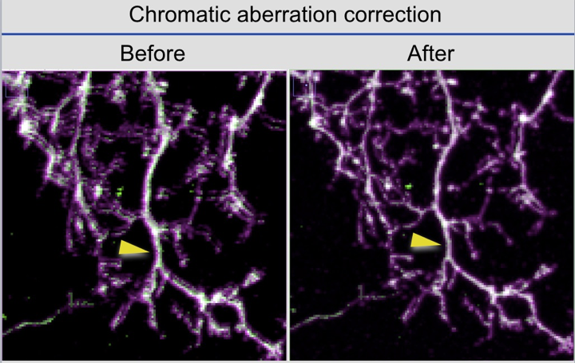

# FlyLight Sample Pipeline

Data on the [Split GAL4](https://splitgal4.janelia.org/) and [Gen1 MCFO](https://gen1mcfo.janelia.org) websites is produced from raw LSM images by the Workstation pipelines. Raw microscope images are grouped by *slide code* to create **Samples**. Each Sample is processed by reconstructing all the acquired imagery for each microscope objective and anatomical area. For example: 20x Brain, 20x VNC, 63x Brain. 

The pipeline consists of the following steps:

4. **LSM Summary** - the LSM images are summarized with MIPs and movies
5. **Distortion Correction** - correction for optical distortions and chromatic aberrations
6. **Sample Processing** - the LSM image tiles are merged and stitched into a single volume
7. **Post Processing** - the tiles and final image are summarized with MIPs and movies
8. **Alignment** - the sample is registered to standard reference images
9. **Color Depth MIPs** - color depths MIPs are generated from the aligned volumes
10. **Compression** - image files are compressed 

Detailed information for reproducing each result is documented below.

## LSM Summary

MIPs and movies for LSMs are generated using [basicMIP.sh](https://github.com/JaneliaSciComp/jacs-tools-docker/blob/master/flylight_tools/scripts/cmd/basicMIP.sh) in the flylight_tools container. 

The specific options passed to this script are:
* `LASER`: laser power, extracted from LSM metadata
* `GAIN`: laser gain, extracted from LSM metadata
* `CHAN_SPEC`: channel specification string listing (s)ignal and (r)eference channels contained in the LSM file, e.g. `rss`
* `COLOR_SPEC`: colors to use for each channel, extracted from the LSM metadata, e.g. `1BG` for a grey reference with blue and green signals
* `DIV_SPEC`: division spec which is used to attenuate the brightness of the reference channel by dividing the intensity, e.g. `211`
* `OPTIONS`: options used by the Fiji macro, in the case of LSMs we use "mips:movies:legends:bcomp"

## Distortion Correction

(Authored by Hideo Otsuna)

Confocal scanned images have optical distortions. Without the distortion correction, the confocal images show two main problems:

1. The shifted position problem between different channels. Each channel has different distortion in multi-channel confocal data. If we simply merge multiple channels, the co-localized signal will not stay in the same place in around ~70-100% of the peripheral area (0% is the center, 100% is the edge) of the confocal view.

Left panel: The neuron with chromatic aberration. The green and purple signals are shifted. Right panel: After the chromatic aberration correction. The green and purple are staying in same position.

2. Double blended signals between overlapping tiles. The optical distortion leads to image distortion. If the multiple distorted images are stitched together, the overlapped area will not match perfectly. This mismatch can be seen as “double blended signals”.   

Left panel: Before the distortion correction. Right panel: After the distortion correction.

### Implementation 

Stephan Saalfeld originally created this method for correcting the chromatic aberration and the distortion correction by using TrackEM2. We modified the Java code for implementation, performed image quality tests by using more than ~2000 confocal tiles 
and wrote the distortion fields auto-selector ([code](https://github.com/JaneliaSciComp/otsunah/tree/master/Distortion_correction)).

### The nature of the distortion/chromatic aberration

We found that the distortion exhibits slight fluctuation in every confocal scan. After the distortion correction, ~1-2% of images still have double blend signals after the stitching. The double blended signals can sometimes be fixed by using the 
distortion field from other scopes.

The distortion was changing every several months. After large changes in the distortion, previous distortion fields do not fix the double blending problem. Once we detect the double blending problem in our pipeline results, we need to 
re-take the image (glass beads 4x4 tiles with 60% overlapping), then generate a new distortion field. Scope 1 63x changed the distortion over about a five month period, and Scope 2 63x changed over ~8 months, Scope 5 63x changed over ~6 months, and 
Scope 6 63x over ~9 months.

### List of the distortion fields

Files are named with the format scope#_objective+resolution_the first day for applying the field: year_MMDDHH.json file, ~10kb.

If the sample capture date is earlier than the field capture date, our pipeline will use the oldest field for the sample.  Hideo found the many of samples from 2013 could fix/improve the double blending by using the distortion field from 2016 (except scope 1).

The distortion fields for each microscope can be found in the [confocal-distortion-fields](https://github.com/JaneliaSciComp/confocal-distortion-fields) repository.

## Sample Processing

The sample processing step reconstructs a single image for each objective/area combination in the sample by merging tiles, stitching them together, and converting the file into a normalized "sample image" representation with predictable channel ordering. 

### Merging

When more than 3 signal channels are captured on the Zeiss microscopes, they are usually captured in 2 passes, and 2 LSM files are produced. Each file contains a reference channel and 1 or more signal channels. 
The pipeline always begins by merging any LSM pairs using either a rigid or non-rigid transformation using the [ANTS](http://stnava.github.io/ANTs/) toolkit. The merge algorithm arranges the channels in the output file according to one of two methods:
* **Multicolor** - this algorithm is usually specified when the content is "multicolor" (e.g. MCFO) and the channel colors are RGB. The merge program reads the channel colors encoded in the LSM file and rearranges them in order as: red, green, blue, reference. 
* **Ordered** - this algorithm is usually specified for non-multicolor images. The original channel order is preserved, apart from the reference channel which is always put last.

The merge step does NOT use reference channel information from the metadata. Instead, it does a pair-wise comparison of all channels, and picks the two most similar channels across both files to serve as the reference. 
We use mutual information (MI) to compare all pair-wise color channels to find the reference color channel based on the assumption of the reference color channels have more similarity. Then we use block matching approach to determine the 
transformation type. If the transformation type is pure translations, we use a fast template matching approach to estimate the transformation. If the transformation type is non-rigid, we use ANTS (MI and SyN) to estimate deformable transformation.

This step is implemented by the [merge.sh](https://github.com/JaneliaSciComp/jacs-tools-docker/blob/master/flylight_tools/scripts/cmd/merge.sh) script in the flylight_tools container.

### Stitching 

In cases where there is only a single tile per objective and anatomical area, this step is skipped.

In cases where multiple image tiles have the same objective and anatomical area, they are clustered into non-overlapping groups by the "grouping" algorithm. There is currently no pipeline support for stitching multiple groups of images per Sample,
so only the largest group is stitched together and blended.

This step is implemented by the [stitchAndBlend.sh](https://github.com/JaneliaSciComp/jacs-tools-docker/blob/master/flylight_tools/scripts/cmd/stitchAndBlend.sh) script in the flylight_tools container.

The actual stitching is done using Yang Yu's [iStitch and iFusion plugins](https://code.google.com/p/vaa3d/wiki/imageStitch) for Vaa3d. The underlying stitching algorithm is described in [this paper](http://home.penglab.com/papersall/docpdf/2011_ISBI_istitch.pdf).
  
### Conversion to Sample Image

In many cases, the LSMs that come off the scopes do not have their channels in any particular order, and the order can change with the imaging protocol. In some cases the channel order is rearranged by the LSM Merging step as described in the previous section. 
In order to normalize the order of the channels, each pipeline is configured to use one of two methods:
* Channel Specification - each LSM is annotated with a chan_spec annotation such as "rss" or "sr" which lists in order the content of each channel in the file ("s" for signal, and "r" for reference).
  The pipeline rearranges the channels so that the reference channel is last. If this was already completed by the merge step, then this step is skipped. Obviously, this method cannot distinguish between different signal types.
  No channels are ever discarded with this method.
* Dye Specification - each pipeline using this method is configured to associate certain dye names to content types. For example if the dye is "Alexa Fluor 633" or "Alexa Fluor 647" then the channel content is "presynaptic".
  The dye information that was read from the LSM files during the LSM Metadata Extraction step is used to rearrange the channels in some predetermined order (e.g. presynaptic, membrance, reference). Unused channels are discarded.

Aside from channel reordering, this step also ensures that the sample images are in v3draw/v3dpbd format to be ready for further processing.

## Post Processing

The post processing step generates MIPs and movies for merged tiles and stitched images. In the case of 20x images, the MIPs are generated using a [basicMIP.sh](https://github.com/JaneliaSciComp/jacs-tools-docker/blob/master/flylight_tools/scripts/cmd/basicMIP.sh) script, which is the same as for the raw LSMs. The options used are different however.

The specific options passed to this script for 20x imagery are:
* `LASER`: empty
* `GAIN`: empty
* `CHAN_SPEC`: channel specification string listing (s)ignal and (r)eference channels contained in the LSM file. Because the channels are normalized at this stage, the reference always comes last, e.g. `sssr`
* `COLOR_SPEC`: colors to use for each channel, assigning RGB to the signal channels and 1 (i.e. grey) to reference, e.g. `GYCM` for a 4 channel image or `GM` for a 2 channel image.
* `DIV_SPEC`: empty
* `OPTIONS`: options used by the Fiji macro, in the case of LSMs we use "mips:movies:legends:hist"

In the case of 63x images, the MIPs are generated using a [enchancedMIP.sh](https://github.com/JaneliaSciComp/jacs-tools-docker/blob/master/flylight_tools/scripts/cmd/enchancedMIP.sh) [*sic*] script, which does processing based on whether the data was collecting using an MCFO or Polarity pipeline:

### MCFO

The signal channels will be considered to be multi-color channels. In MCFO mode the following processing steps are taken:
* Adjust intensity for each channels
* Compensate intensity for neuron channels in Z axis (because laser was not ramped only for nc82 channels)
* Remove speckels
* If there are no neurons labeled (and resulted in high background every where), remove all signals for that channel.

The specific options passed to this script for 63x MCFO imagery are:
* `CHAN_SPEC`: channel specification string listing (s)ignal and (r)eference channels contained in the LSM file. Because the channels are normalized at this stage, the reference always comes last, e.g. `sssr`
* `COLOR_SPEC`: colors to use for each channel, assigning RGB to the signal channels and 1 (i.e. grey) to reference, e.g. `RGB1` for a 4 channel image or `R1` for a 2 channel image.
* `OPTIONS`: options used by the Fiji macro, in the case of LSMs we use "mips:movies:legends:hist"

### Polarity

The input file must have 2 or 3 channels, with signals (presynatic,membrane,reference) or (membrane,reference). In Polarity mode the following processing steps are taken:
* Adjust intensity
* Ramp signals in Z axis for neuron channels
* Mask presynaptic marker channel by membrane channel

The specific options passed to this script for 63x Polarity imagery are:
* `CHAN_SPEC`: channel specification string listing (s)ignal and (r)eference channels contained in the LSM file. Because the channels are normalized at this stage, the reference always comes last, e.g. `sssr`
* `COLOR_SPEC`: colors to use for each channel: `G1`, `MG1`, or `MGR1` depending on the number of channels
* `OPTIONS`: options used by the Fiji macro, in the case of LSMs we use "mips:movies:legends:hist"

## Alignment

Also known as image registration, this pipeline stage aligns image stacks to standard templates to enable comparison and search across specimens.

### Templates

The original Brain and VNC templates for Drosophila are [available here](https://www.janelia.org/open-science/jrc-2018-brain-templates). However, these templates are not used in the Workstation pipelines directly, because Janelia doesn’t typically produce data with isometric 0.44 resolution. The original 2018 templates are too big for 20x/40x data, and too small for 63x data. Instead, the templates are resized and made [available on S3](https://open.quiltdata.com/b/janelia-flylight-color-depth/tree/alignment_templates/).

### Alignment Spaces

An alignment space is a consistently sized 3d volume where a template brain has been registered. The following brain alignment spaces are canonical at Janelia:

| Alignment Space	| Gender | Objective†	| Voxel Size (µm)	| Image Size | Notes |
| --------------- | ------ | ---------- | --------------- | ---------- | ----- | 
| JRC2018_FEMALE_20x_gen1	| Female	| 20x_gen1 | 0.6214809x0.6214809x1.0	| 1010x470x182	| |  
| JRC2018_FEMALE_20x_HR	  | Female	| 20x	     | 0.5189161x0.5189161x1.0	| 1210x563x182	| High Resolution for Color Depth Search | 
| JRC2018_MALE_20x_gen1	  | Male	  | 20x_gen1 | 0.6214809x0.6214809x1.0	| 955x455x181	  | | 
| JRC2018_MALE_20x_HR	    | Male	  | 20x	     | 0.5189161x0.5189161x1.0	| 1143x545x181	| High Resolution for Color Depth Search | 
| JRC2018_Unisex_20x_HR	  | Unisex	| 20x_HR	 | 0.5189161x0.5189161x1.0	| 1210x566x174	| High Resolution for Color Depth Search | 
| JRC2018_FEMALE_40x	    | Female	| 40x	     | 0.44x0.44x0.44	          | 1427x664x413	| | 
| JRC2018_MALE_40x	      | Male	  | 40x	     | 0.44x0.44x0.44	          | 1348x642x411	| | 
| JRC2018_Unisex_40x	    | Unisex	| 40x	     | 0.44x0.44x0.44	          | 1427x668x394	| | 
| JRC2018_FEMALE_63x	    | Female	| 63x	     | 0.1882680x0.1882680x0.38	| 3333x1550x478	| | 
| JRC2018_FEMALE_63x_DS	  | Female	| 63x	     | 0.38x0.38x0.38	          | 1652x768x478	| Downsampled (1/2 size) | 
| JRC2018_MALE_63x	      | Male	  | 63x	     | 0.1882680x0.1882680x0.38	| 3150x1500x476	| 
| JRC2018_MALE_63x_DS	    | Male	  | 63x	     | 0.38x0.38x0.38	          | 1561x744x476	| Downsampled (1/2 size) | 
| JRC2018_Unisex_63x_DS	  | Unisex  | 63x	     | 0.38x0.38x0.38	          | 1652x773x456	| Downsampled (1/2 size) | 

† this is the "effective" objective of the template, e.g. what kind of objective might produce data with a voxel size like this

### Aligner Code

Aligners are implemented with Singularity containers in the [jacs-tools repository](https://github.com/JaneliaSciComp/jacs-tools). Each aligner is built into one or more Singularity apps defined in the Singularity file. These apps are invoked by the Workstation pipelines to generate the aligned volumes. 

All brains are first registered to their gender-specific full-scale template, and then transformed into other alignment spaces. The output of the aligner is specific to the input type. Only the gender and unisex_HR alignments are published on our websites. 

### Brain Aligners

#### 20x Aligner

[Source code](https://github.com/JaneliaSciComp/jacs-tools/tree/master/aligner_jrc2018_20x_gen1)

Currently, the mode used is always "align_ol_unknown".

Outputs:

* Alignment to JRC2018_FEMALE_20x_gen1 or JRC2018_MALE_20x_gen1
* Transformation to legacy space JFRC2010_20x
* Transformation to legacy space JFRC2013_20x or JFRC2014_20x
* Transformation to JRC2018_Unisex_20x_HR for color depth search

#### 40x Aligner

[Source code](https://github.com/JaneliaSciComp/jacs-tools/tree/master/aligner_jrc2018_20x_40x)

Currently, the mode used is always "align_both_ol_missing".

Outputs:

* Alignment to JRC2018_FEMALE_40x or JRC2018_MALE_40x
* Transformation to legacy space JFRC2010_20x
* Transformation to legacy space JFRC2013_20x or JFRC2014_20x
* Transformation to JRC2018_Unisex_40x
* Transformation to JRC2018_Unisex_20x_HR for color depth search

#### 63x Aligner

[Source code](https://github.com/JaneliaSciComp/jacs-tools/tree/master/aligner_jrc2018_63x)

Currently, the mode used is always "align_half", which is a downsampled alignment. Specific users who choose to have a full scale alignment, are run with the "align" mode.

Outputs:

* Alignment to JRC2018_FEMALE_63x_DS or JRC2018_MALE_63x_DS
* Transformation to legacy space JFRC2010_20x
* Transformation to legacy space JFRC2013_63x or JFRC2014_63x

#### VNC Aligners

#### 20x/40x Aligner

[Source code](https://github.com/JaneliaSciComp/jacs-tools/tree/master/aligner_vnc2018_20x_40x)

Outputs:

* Alignment to JRC2018_VNC_FEMALE or JRC2018_VNC_MALE
* Transformation to JRC2018_VNC_Unisex
* Transformation to MaleVNC2016_20x (if male)
* Transformation to FemaleVNCSymmetric2017_20x (both male and female)

#### 63x Aligner

[Source code](https://github.com/JaneliaSciComp/jacs-tools/tree/master/aligner_vnc2018_63x)

Outputs:

* Alignment to JRC2018_FEMALE_VNC_63x or JRC2018_MALE_VNC_63x
* Transformation to JRC2018_Unisex_VNC_63x
* Transformation to JRC2018_Unisex_VNC_20x
* Transformation to MaleVNC2016_20x (if male)
* Transformation to FemaleVNCSymmetric2017_20x (both male and female)

## Color Depth MIPs

Color depth MIPs are created from the aligned image stacks to support neuron searching on [NeuronBridge](https://neuronbridge.janelia.org). 

This step is implemented by the [colorDepthMIP.sh](https://github.com/JaneliaSciComp/jacs-tools-docker/blob/master/flylight_tools/scripts/cmd/colorDepthMIP.sh) script in the flylight_tools container.

  
## Compression

Image stacks (in v3dpbd format) are compressed using the [H5J file format](H5JFileFormat.md).

We delete all merged image stacks for individual tiles and only keep the final stitched images (or unstitched sample images if no stitching was necessary.) 
